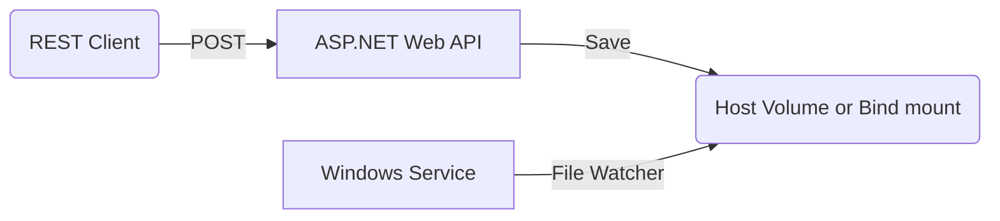

Windows Docker Sample
=====================

Sample Windows apps running in Docker containers consisting of:

- ASP.NET Framework Web API to persist JSON files to a host volume
- .NET Framework Windows Service to watch a host volume for new files



Apps built with .NET Framework 4.8.1 on Visual Studio 2022.

To run Dockerized versions locally, you'll need a Docker environment like Docker Desktop and internet access to `mcr.microsoft.com` to pull the base container images (these are quite large, several GB in size).

MyNewService - Windows Service (.NET Framework)
-----------------------------------------------

To test locally without installing as a service:

* Create the directory `C:\uploads\`
* Change project Output Type to "Console Application"
* Press F5 to build and run/debug
* Output logs appear in the console
* Copy a JSON file to `C:\uploads\`
* PRess ENTER to exit

To test as a Windows Service:

* installutil MyNewService.exe
* Open the Services desktop app. Press Windows+R to open the Run box, enter services.msc, and then press Enter or select OK.
* To start the service, choose Start from the service's shortcut menu.
* Output logs appear in the Event Log (open the  Event Viewer to see these)
* To stop the service, choose Stop from the service's shortcut menu.
* To uninstall the service: `installutil.exe /u MyNewService.exe`

WebUploaderApp - ASP.NET Framework Web API
------------------------------------------

To test locally:

* Create the directory `C:\uploads\`
* Make a HTTP POST request to the API:

```powershell
curl -i -X POST -H "Content-type: application/json" https://localhost:44334/api/Docs -d @payload1.json
```

* Check C:\uploads\ for the file

Run everything with Visual Studio 2022
--------------------------------------

* Ensure multiple start-up projects are selected in the solution properties: Project(s): WebUploaderApp and MyNewService, Action: Start
* Press F5 to build and run/debug

Dockerize the Windows Service
-----------------------------

```powershell
docker build -t mynewservice:v1.0 .
docker run --rm --name mynewservice mynewservice:v1.0
docker exec -ti mynewservice -- powershell

Get-Service -Name "MyNewService"
cd c:\uploads\
echo "test" > test1.json
exit
```

Dockerize the ASP.NET Web API
-----------------------------

```powershell
docker build -t webuploaderapp:v1.0 .
docker run --rm --name webuploaderapp -p 8080:80 webuploaderapp:v1.0

curl -i -X POST -H "Content-type: application/json" http://localhost:8080/api/Docs -d @payload1.json
```

Run everything with Docker Compose
----------------------------------

```powershell
mkdir ./uploads
docker-compose up

curl -i -X POST -H "Content-type: application/json" http://localhost:8080/api/Docs -d @payload1.json

dir ./uploads
# payload1.json

# CTRL+C to stop
```

Deploy to Azure Kubernetes Service
----------------------------------

Create a basic AKS cluster (not for production, just for demo purposes)

```powershell
$Cluster_Name="winappaks"
$Resource_Group="winappdemo"

# Adjust to a region near you
$Location="australiaeast"
```

Create the AKS cluster:

```powershell
az group create --name $Resource_Group --location $Location

$Kubernetes_Latest_Version=(az aks get-versions --location $Location --query "values[?!isPreview].version" --output tsv) -split '\n' | Sort-Object {[Version]$_} -Descending | Select-Object -First 1

if (Test-Path "win-password.txt") {
    $Win_Password = Get-Content "win-password.txt"
} else {
    $Win_Password = [System.Convert]::ToBase64String((1..32|%{Get-Random -Maximum 256}))
    $Win_Password | Out-File "win-password.txt"
}

$Win_User="azureuser"

az aks create `
    --resource-group $Resource_Group `
    --name $Cluster_Name `
    --node-count 2 `
    --enable-addons monitoring `
    --generate-ssh-keys `
    --network-plugin azure `
    --enable-managed-identity `
    --windows-admin-username $Win_User `
    --windows-admin-password $Win_Password `
    --kubernetes-version $Kubernetes_Latest_Version

az aks get-credentials --resource-group $Resource_Group --name $Cluster_Name
az aks install-cli
```

Add a Windows node pool to the cluster:

```powershell
# Add a 4 vCore node pool running Windows Server 2022
az aks nodepool add `
    --resource-group $Resource_Group `
    --cluster-name $Cluster_Name `
    --os-type Windows `
    --name npwin `
    --node-count 1 `
    --node-vm-size Standard_D4s_v3 `
    --kubernetes-version $Kubernetes_Latest_Version
```

Query the cluster nodes:

```powershell
kubectl get nodes -o wide
```

Create Azure Container Registry (ACR) for storing container images:

```powershell
# append random digits to make unique
$ACR_Name="winappacr$((Get-Random -Minimum 1000 -Maximum 9999).ToString())"  
az acr create --resource-group $Resource_Group --name $ACR_Name --sku Standard --location $Location
```

Grant image pull access to ACR from the AKS cluster:

```powershell
az aks update -n $Cluster_Name -g $Resource_Group --attach-acr $ACR_Name
```

Build and push the container images to ACR using ACR build tasks for Windows container images:

```powershell
az acr build --registry $ACR_Name --image mynewservice:v1.0 --file .\MyNewService\Dockerfile .\MyNewService\ --platform windows

az acr build --registry $ACR_Name --image webuploaderapp:v1.0 --file .\WebUploaderApp\Dockerfile .\WebUploaderApp\ --platform windows
```

Create a namespace for the Windows apps:

```powershell
kubectl create namespace winapp
```

Create a custom storage class for Azure Files premium storage:

```powershell
kubectl apply -f kubernetes/docs-afs.sc.yaml
```

Create the Azure Files PVC:

```powershell
kubectl apply -f kubernetes\docs-pvc.yaml --namespace winapp
```

Deploy the Windows Service to the cluster:

```powershell
# Update the image reference to point to your ACR name
kubectl apply -f kubernetes\mynewservice.app.yaml --namespace winapp

$MyNewService_Pod_Name=(kubectl get pods -n winapp -l app=mynewservice -o jsonpath='{.items[0].metadata.name}')

kubectl logs $MyNewService_Pod_Name -n winapp -f
```

Deploy the ASP.NET Web API to the cluster:

```powershell
# Update the image reference to point to your ACR name
kubectl apply -f kubernetes\webuploader.app.yaml --namespace winapp

$WebUploader_Pod_Name=(kubectl get pods -n winapp -l app=webuploader -o jsonpath='{.items[0].metadata.name}')

kubectl logs $WebUploader_Pod_Name -n winapp -f

kubectl port-forward svc/webuploader 8080:80 -n winapp

curl -i -X POST -H "Content-type: application/json" http://localhost:8080/api/Docs -d @payload1.json

curl -i -X POST -H "Content-type: application/json" http://localhost:8080/api/Docs -d @payload2.json
```

Check the logs for MyNewService.

You can also browse the files in the Azure Files storage account in The Azure Portal - look for the Managed Resource group for AKS, unless you used static provisioning of the Azure Files storage account.

(Optional) Setup Ingress Controller
-----------------------------------

```powershell
$Namespace=ingress-basic

helm repo add ingress-nginx https://kubernetes.github.io/ingress-nginx
helm repo update

helm install ingress-nginx ingress-nginx/ingress-nginx `
  --create-namespace `
  --namespace $Namespace `
  --set controller.service.annotations."service\.beta\.kubernetes\.io/azure-load-balancer-health-probe-request-path"=/healthz

$Ingress_IP=(kubectl get services -n $Namespace ingress-nginx-controller -o jsonpath='{.status.loadBalancer.ingress[0].ip}')

# Name to associate with public IP address
$DNS_Label="webuploader$((Get-Random -Minimum 1000 -Maximum 9999).ToString())"
echo $DNS_Label

# Get the resource-id of the public IP
$Public_IP_Res_Id=$(az network public-ip list --query "[?ipAddress!=null]|[?contains(ipAddress, '$Ingress_IP')].[id]" --output tsv)

# Update public IP address with DNS name
az network public-ip update --ids $Public_IP_Res_Id --dns-name $DNS_Label

# Display the FQDN
az network public-ip show --ids $Public_IP_Res_Id --query "[dnsSettings.fqdn]" --output tsv

# e.g. webuploaderXXXXXX.australiaeast.cloudapp.azure.com

kubectl apply -f .\kubernetes\webuploader.ingress.yaml -n winapp
```

Access the Web API using: `https://webuploaderXXXXXX.australiaeast.cloudapp.azure.com/api/Docs`

(Optional) Configure TLS on Ingress Controller with Let's Encrypt
-----------------------------------------------------------------

```powershell
# TODO: refer to https://learn.microsoft.com/en-us/azure/aks/ingress-tls
```

Monitoring and Logs
-------------------

* View Logs and try these container log queries:

```kql
ContainerLog
| where LogEntry contains "MyNewService - "
| where LogEntry contains "Message"
```

```kql
ContainerLog
| where LogEntry contains "MyNewService - "
| where LogEntry contains "Message"
| where LogEntry !contains "Monitoring"
| parse LogEntry with * "MyNewService - " updateType ": " filePath
| summarize Count=count() by updateType
```

* View as a Table.
* View as a Chart.

Resources / Credits
-------------------

* https://learn.microsoft.com/en-us/dotnet/framework/windows-services/walkthrough-creating-a-windows-service-application-in-the-component-designer
* https://learn.microsoft.com/en-us/dotnet/framework/windows-services/service-application-programming-architecture
* https://learn.microsoft.com/en-us/dotnet/api/system.io.filesystemwatcher?view=netframework-4.8.1
* https://github.com/mihaitibrea/docker-windows-service/tree/master - Example to run a Windows Service in a Docker container
* https://learn.microsoft.com/en-us/azure/aks/ingress-tls - AKS Ingress with TLS
