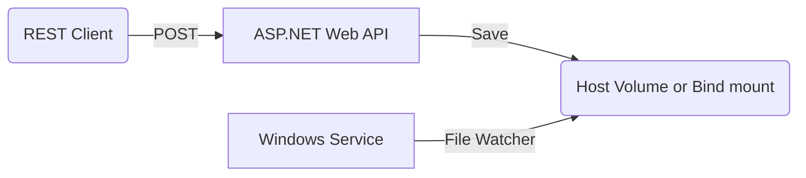

Windows Docker Sample
=====================

Sample Windows apps running in Docker containers consisting of:

- ASP.NET Framework Web API to persist JSON files to a host volume
- .NET Framework Windows Service to watch a host volume for new files



Apps built with .NET Framework 4.8.1 on Visual Studio 2022.

To run Dockerized versions locally, you'll need a Docker environment like Docker Desktop and internet access to `mcr.microsoft.com` to pull the base container images (these are quite large, several GB in size).

MyNewService - Windows Service (.NET Framework)
-----------------------------------------------

To test locally without installing as a service:

* Create the directory `C:\uploads\`
* Change project Output Type to "Console Application"
* Press F5 to build and run/debug
* Output logs appear in the console
* Copy a JSON file to `C:\uploads\`
* PRess ENTER to exit

To test as a Windows Service:

* installutil MyNewService.exe
* Open the Services desktop app. Press Windows+R to open the Run box, enter services.msc, and then press Enter or select OK.
* To start the service, choose Start from the service's shortcut menu.
* Output logs appear in the Event Log (open the  Event Viewer to see these)
* To stop the service, choose Stop from the service's shortcut menu.
* To uninstall the service: `installutil.exe /u MyNewService.exe`

WebUploaderApp - ASP.NET Framework Web API
------------------------------------------

To test locally:

* Create the directory `C:\uploads\`
* Make a HTTP POST request to the API:

```cmd
curl -i -X POST -H "Content-type: application/json" https://localhost:44334/api/Docs -d @payload1.json
```

* Check C:\uploads\ for the file

Run everything with Visual Studio 2022
--------------------------------------

* Ensure multiple start-up projects are selected in the solution properties: Project(s): WebUploaderApp and MyNewService, Action: Start
* Press F5 to build and run/debug

Dockerize the Windows Service
-----------------------------

```powershell
docker build -t mynewservice:v1.0 .
docker run --rm --name mynewservice mynewservice:v1.0
docker exec -ti mynewservice -- powershell

Get-Service -Name "MyNewService"
cd c:\uploads\
echo "test" > test1.json
exit
```

Dockerize the ASP.NET Web API
-----------------------------

```powershell
docker build -t webuploaderapp:v1.0 .
docker run --rm --name webuploaderapp -p 8080:80 webuploaderapp:v1.0

curl -i -X POST -H "Content-type: application/json" http://localhost:8080/api/Docs -d @payload1.json
```

Run everything with Docker Compose
----------------------------------

```powershell
mkdir ./uploads
docker-compose up

curl -i -X POST -H "Content-type: application/json" http://localhost:8080/api/Docs -d @payload1.json

dir ./uploads
# payload1.json

# CTRL+C to stop
```

Resources / Credits
-------------------

* https://learn.microsoft.com/en-us/dotnet/framework/windows-services/walkthrough-creating-a-windows-service-application-in-the-component-designer
* https://learn.microsoft.com/en-us/dotnet/framework/windows-services/service-application-programming-architecture
* https://learn.microsoft.com/en-us/dotnet/api/system.io.filesystemwatcher?view=netframework-4.8.1
* https://github.com/mihaitibrea/docker-windows-service/tree/master - Example to run a Windows Service in a Docker container
